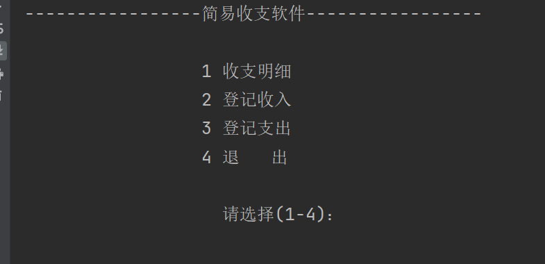
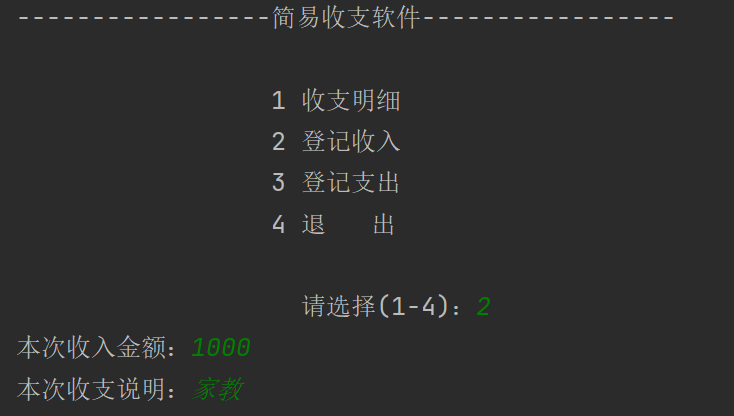
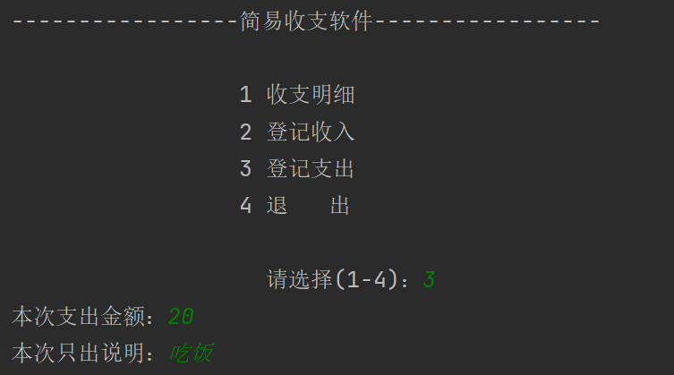
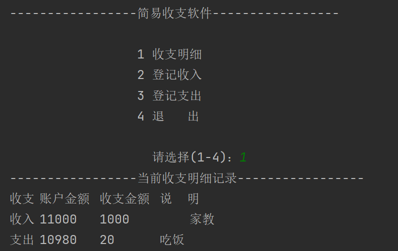

> 项目名称

简易记账系统

> 项目概览

基于java最基础的，面向对象之前的知识点的一个控制台记账系统

功能说明/截图:

**Account类**

1. 主页面

   依靠用户在控制台输入的1~4数字判断对应的分支功能

2. 登记收入与收入备注 

3.登记支出与支出明细

最后选择查看收支明细或者退出(一旦退出所有明细都会丢失)

**Utility类**

主要封装了一些public静态方法

通过类名 . 方法名即可使用